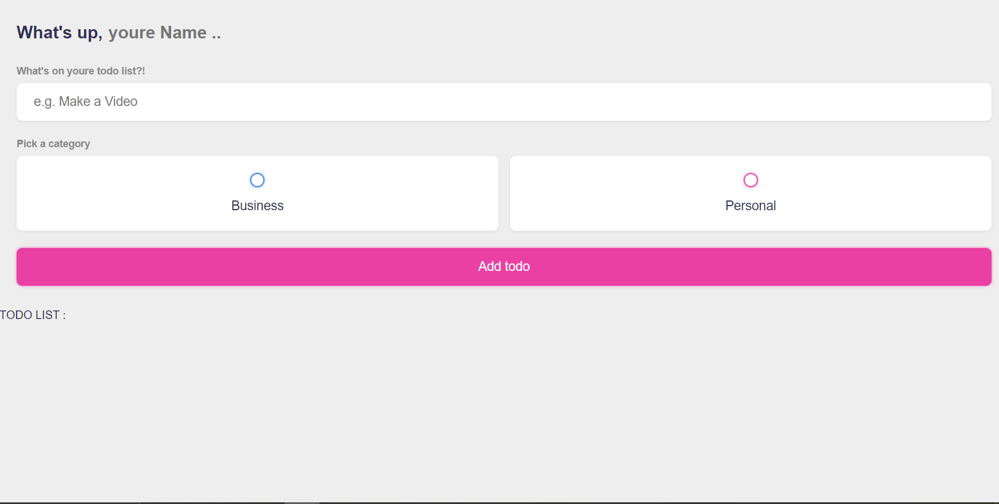

# Vue 3 Todo List 📃

An To-do List app built with Vue 3 and the composition API.

- Add youre work & tasks 📝
- Separate and distinguish the tasks 💻
- Save data to local storage 
- [Vue Toastification](https://github.com/Maronato/vue-toastification) for notifications
- `<script setup>` syntax (Vue 3.2+)



## Project Setup

```sh
npm install
```

### Compile and Hot-Reload for Development

```sh
npm run dev
```

### Compile and Minify for Production

```sh
npm run build
```
